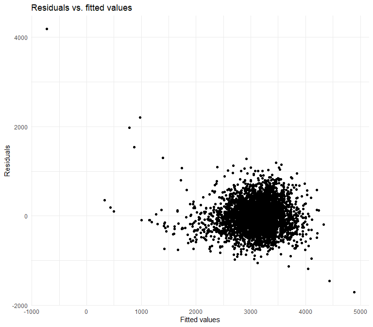
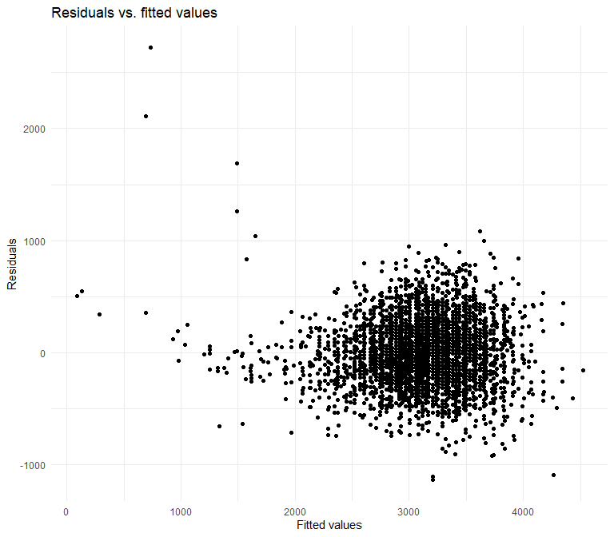
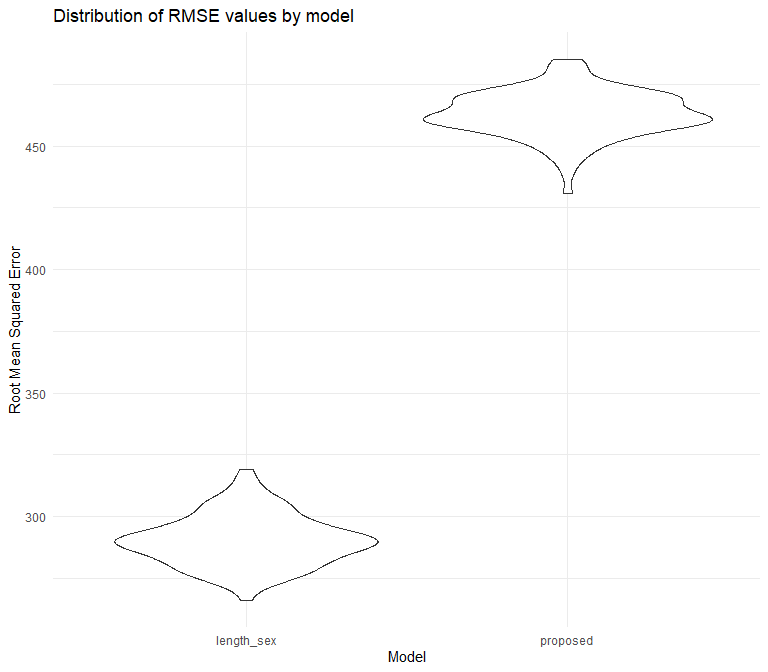

p8105_hw6_jmm2511
================
Jessie Merrifield
2023-11-30

# Problem 2

Using Central Park weather data

``` r
weather_df = 
  rnoaa::meteo_pull_monitors(
    c("USW00094728"),
    var = c("PRCP", "TMIN", "TMAX"), 
    date_min = "2022-01-01",
    date_max = "2022-12-31") |>
  mutate(
    name = recode(id, USW00094728 = "CentralPark_NY"),
    tmin = tmin / 10,
    tmax = tmax / 10) |>
  select(name, id, everything())
```

    ## using cached file: C:\Users\jmoon\AppData\Local/R/cache/R/rnoaa/noaa_ghcnd/USW00094728.dly

    ## date created (size, mb): 2023-12-01 01:31:17.718042 (8.561)

    ## file min/max dates: 1869-01-01 / 2023-11-30

a simple linear regression with tmax as the response with tmin and prcp
as the predictors, and are interested in the distribution of two
quantities estimated from these data:

r^2 log(β<sup>1∗β</sup>2)

Use 5000 bootstrap samples and, for each bootstrap sample, produce
estimates of these two quantities.

``` r
q2_estimates = weather_df %>% 
  modelr::bootstrap(5000, id = "strap_number") %>% 
  mutate(
    models = map(.x = strap, ~lm(tmax ~ tmin + prcp, data=.x)),
    tidy_results = map(models, broom::tidy),
    glance_results = map(models, broom::glance)
  ) %>% 
  select(strap_number, tidy_results, glance_results) %>% 
  unnest(tidy_results, glance_results) %>% 
  group_by(strap_number) %>% 
  summarise(log_product = log(estimate[term == "tmin"] * estimate[term == "prcp"]),
            r_squared=r.squared)%>%
  filter(!is.nan(log_product), !is.nan(r_squared))
```

    ## `summarise()` has grouped output by 'strap_number'. You can override using the
    ## `.groups` argument.

``` r
#removed NaN values

head(q2_estimates)
```

    ## # A tibble: 6 × 3
    ## # Groups:   strap_number [2]
    ##   strap_number log_product r_squared
    ##   <chr>              <dbl>     <dbl>
    ## 1 0001               -5.44     0.898
    ## 2 0001               -5.44     0.898
    ## 3 0001               -5.44     0.898
    ## 4 0006               -7.18     0.918
    ## 5 0006               -7.18     0.918
    ## 6 0006               -7.18     0.918

Plot the distribution of your estimates, and describe these in words.

``` r
q2_plot_r2 <- q2_estimates %>% 
  ggplot(aes(x=r_squared))+
  geom_density()+
  labs(
    title = "Distribution of R^2 estimates",
    x = "R^2 ",
    y = "Density")

q2_plot_r2
```


There is a normal distribution with a mean of r^2 around 0.905

``` r
q2_plot_log <- q2_estimates %>% 
  ggplot(aes(x=log_product))+
  geom_density()+
  labs(
    title = "Distribution of log(β^1*β^2) estimates",
    x = "log(β^1*β^2)",
    y = "Density")

q2_plot_log
```


There is a skewed normal distribution of log(β^1\*β^2) estimates with an
average around -6.

Using the 5000 bootstrap estimates, identify the 2.5% and 97.5%
quantiles to provide a 95% confidence interval for r^2 and
log(β<sup>0∗β</sup>1)

``` r
log_product_quantiles <- quantile(q2_estimates$log_product, c(0.025, 0.975))
#had to do it this way because I had previously grouped by strap_number

log_product_quantiles
```

    ##      2.5%     97.5% 
    ## -8.981766 -4.601534

``` r
r2_quantiles <- quantile(q2_estimates$r_squared, c(0.025, 0.975))

r2_quantiles
```

    ##      2.5%     97.5% 
    ## 0.8804482 0.9271143

. Note: broom::glance() is helpful for extracting r^2 from a fitted
regression, and broom::tidy() (with some additional wrangling) should
help in computing log(β<sup>1∗β</sup>2)

# Problem 3

In this problem, you will analyze data gathered to understand the
effects of several variables on a child’s birthweight.

Load and clean the data for regression analysis (i.e. convert numeric to
factor where appropriate, check for missing data, etc.).

``` r
birthweight<-read.csv("./data/birthweight.csv") %>% 
  mutate(babysex = recode(babysex, "1" ="male", "2" = "female"), 
         babysex=factor(babysex))

lapply(birthweight,class)
#variables in integer and numeric

sum(is.na(birthweight))
#no missing 
```

Propose a regression model for birthweight. This model may be based on a
hypothesized structure for the factors that underly birthweight, on a
data-driven model-building process, or a combination of the two.
Describe your modeling process and show a plot of model residuals
against fitted values – use add_predictions and add_residuals in making
this plot.

``` r
q3_fit_proposed<-lm(bwt ~ gaweeks + fincome + momage, data= birthweight)

#I did a quick search to see what factors might be commonly linked to birthweight

birthweight |> 
  modelr::add_residuals(q3_fit_proposed) |> 
  modelr::add_predictions(q3_fit_proposed) |> 
  ggplot(aes(x = pred, y = resid)) + 
  geom_point()+
  labs(
    title = "Residuals vs. fitted values",
    x = "Fitted values",
    y = "Residuals")
```


### Compare your model to two others:

One using length at birth and gestational age as predictors (main
effects only)

``` r
q3_fit_length_weeks <- lm(bwt ~ blength + gaweeks, data = birthweight)

birthweight |> 
  modelr::add_residuals(q3_fit_length_weeks) |> 
  modelr::add_predictions(q3_fit_length_weeks) |> 
  ggplot(aes(x = pred, y = resid)) + 
  geom_point()+
  labs(
    title = "Residuals vs. fitted values",
    x = "Fitted values",
    y = "Residuals")
```



One using head circumference, length, sex, and all interactions
(including the three-way interaction) between these Make this comparison
in terms of the cross-validated prediction error; use crossv_mc and
functions in purrr as appropriate.

``` r
q3_fit_length_sex<- lm(bwt ~ bhead * blength + bhead * babysex + blength * babysex, data = birthweight)

birthweight |> 
  modelr::add_residuals(q3_fit_length_sex) |> 
  modelr::add_predictions(q3_fit_length_sex) |> 
  ggplot(aes(x = pred, y = resid)) + 
  geom_point()+
  labs(
    title = "Residuals vs. fitted values",
    x = "Fitted values",
    y = "Residuals")
```



``` r
cv_df <- crossv_mc(birthweight, 100) |> 
  mutate(
    train = map(train, as_tibble),
    test = map(test, as_tibble)
  )


cv_df <- cv_df |> 
  mutate(
    length_sex_mod = map(train, \(df) lm(bwt ~ bhead * blength + bhead * babysex + blength * babysex, data = df)),
    proposed_mod = map(train, \(df) lm(bwt ~ gaweeks + fincome + momage, data = df))
  ) |> 
  mutate(
    rmse_length_sex = map2_dbl(length_sex_mod, test, \(mod, df) rmse(model = mod, data = df)),
    rmse_proposed = map2_dbl(proposed_mod, test, \(mod, df) rmse(model = mod, data = df))
  )


cv_df |> 
  select(starts_with("rmse")) |> 
  pivot_longer(
    everything(),
    names_to = "model", 
    values_to = "rmse",
    names_prefix = "rmse_"
  ) |> 
  mutate(model = fct_inorder(model)) |> 
  ggplot(aes(x = model, y = rmse)) + geom_violin() +
  labs(
    title = "Distribution of RMSE values by model",
    y = "Root Mean Squared Error",
    x = "Model")                         
```



The proposed model is not as good.
